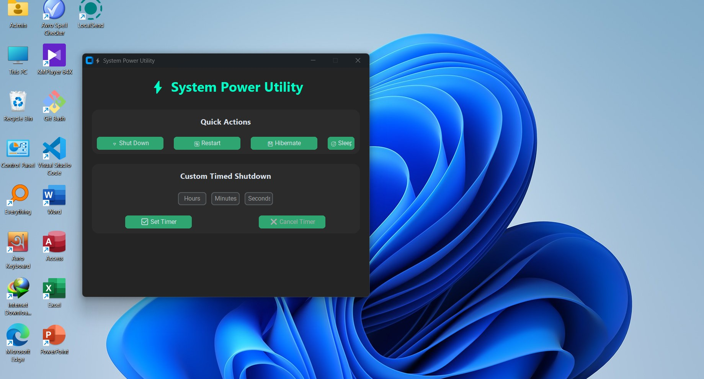

# ⚡ PC Power Manager

A modern, sleek system power utility built in Python with a GUI.  
Supports **Shutdown, Restart, Sleep, Hibernate**, and **Custom Timed Shutdowns**.

---

## 📂 Repository Structure

```

PC-Power-Manager/
├── README.md                  <- This file
├── source/                    <- Source code folder
│   ├── power\_manager.py       <- Main Python script
│   ├── shutdown.ico           <- Icon file
│   └── requirements.txt       <- Python dependencies
└── releases/                  <- EXE releases
├── v1.0/
│   └── power\_manager.exe
└── v2.0/
└── power\_manager\_v2.exe

```

---

## 🖥 Features

- Quick Actions: Shut Down, Restart, Sleep, Hibernate  
- Custom Timed Shutdown: Set hours, minutes, and seconds countdown  
- Modern, user-friendly GUI built with `tkinter`  
- Cross-platform support (Windows/Linux/macOS, with some limitations)  

---

## ⬇️ Download EXE

| Version | File Name | Download |
|---------|-----------|---------|
| v1.0    | `power_manager.exe`       | [💾 Download](releases/v1.0/power_manager.exe) |
| v2.0    | `power_manager_v2.exe`    | [💾 Download](releases/v2.0/power_manager_v2.exe) |

> 💡 No Python installation is required to run the EXE.

---

## 📸 Screenshots

  
*(Add more screenshots if needed)*

---

## 📌 Notes

- **Administrator privileges** may be required for shutdown, restart, or hibernate actions.  
- On **macOS/Linux**, some commands may require `sudo`.  

---

## 📝 Contribution

We welcome contributions!  

- Open issues to report bugs or request features  
- Submit pull requests to improve the GUI, add features, or fix issues  

---
## 📄 License

This project is licensed under the **MIT License**.  
See the full license [here](LICENSE).

<p align="center">
  <a href="https://www.python.org/"></a> &nbsp;&nbsp;&nbsp;
  <a href="releases/v2.0/power_manager_v2.exe"></a> &nbsp;&nbsp;&nbsp;
  <a href="LICENSE"></a>
</p>

